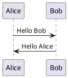
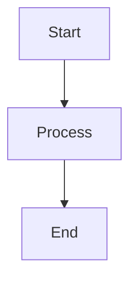

# show-off

Reveal.js is great, but managing presentations with it can be a hassle. You have to drag around a `dist/` directory, set up local HTTP servers just to preview your slides, deal with broken relative paths for images, and fight with CSS for custom layouts.

`show-off` is a simple Python CLI that takes a single Markdown file and compiles it into a completely standalone, beautiful HTML slideshow. 

No directories to manage, no CDNs to fetch, and everything—including your images, styles, and diagrams—is packed into a single offline-ready file that you can share and present anywhere.

---

## Dependencies

- **Python**: `>= 3.8`
- **Python Libraries**: `PyYAML>=6.0` (automatically installed via pip)
- **Diagram Engines**:
  - **PlantUML**: Automatically detects if the local `plantuml` executable is installed in your system path and compiles diagrams 100% offline. If local `plantuml` is not found, it gracefully falls back to the online `plantuml.com` API (which requires an internet connection during compilation).
  - **Mermaid**: Completely offline-ready. On the first diagram compilation, the compiler downloads `mermaid.min.js` to `~/.show-off/mermaid.min.js` and caches it. It is then inline-embedded directly into your HTML presentation.

---

## Installation

Install it directly via pip:
```bash
pip install show-off
```

Or clone the repository and install it locally:
```bash
git clone https://github.com/reharish/show-off.git
cd show-off
pip3 install -e . --break-system-packages
```

---

## Getting Started

To get started quickly, create a plain Markdown file without any complex layouts or images.

### 1. Create a `plain.md` file
Write your slide content in a file named `plain.md`:

```markdown
---
title: "Simple Presentation"
theme: white
transition: slide
---

# My Presentation 🚀

## Welcome
This is a simple presentation created with show-off.

## Features
- Easy to use
- Plain Markdown
- HTML & CSS styling
```

### 2. Compile your presentation
Run the following command to compile your slideshow:
```bash
show-off plain.md
```
This will compile the markdown and output a single, standalone `plain.html` file in the same directory. Open `plain.html` directly in your browser to view your presentation!

---

## Advanced Usage

For more advanced slideshows, you can use frontmatter headers, custom layouts, diagrams, and speaker notes.

### 1. Frontmatter Configuration
You can customize the slideshow using the YAML block at the top of your Markdown file:

```yaml
---
title: "My Presentation"
theme: dracula               # reveal.js theme (dracula, moon, night, solarized, etc.)
transition: slide            # transition effect (slide, fade, zoom)
eyeCatchy: true              # set to false to fallback to plain reveal.js styling
revealConfig:
  controls: true             # show navigation arrows
  progress: true             # show bottom progress bar
  slideNumber: true          # show slide page numbers
css: |                       # write inline CSS styles to override anything
  .reveal h2 {
    color: #38bdf8 !important;
  }
---
```

### 2. Slide Separators
By default, slides are split automatically by H1 (`#`) and H2 (`##`) headers. 
Alternatively, you can configure manual horizontal and vertical slide separators in your frontmatter:
```yaml
slideSeparator: "^---$"
slideSeparatorVertical: "^--$"
```

### 3. Custom Layouts
Since the output is compiled to HTML, you can drop inline HTML elements (like flexbox/grid divs) directly into your Markdown for complex multi-column layouts:

```html
## Two Column Layout

<div style="display: flex; gap: 20px;">
  <div style="flex: 1; text-align: left; background: rgba(0,0,0,0.02); padding: 20px; border-radius: 10px;">
    <h3>Left Column</h3>
    <p>Using standard HTML and inline styles, you can create grid layouts easily.</p>
  </div>
  <div style="flex: 1; text-align: left; background: rgba(0,0,0,0.02); padding: 20px; border-radius: 10px;">
    <h3>Right Column</h3>
    <p>No complex markdown tricks required.</p>
  </div>
</div>
```

### 4. Diagrams Support
You can render PlantUML or Mermaid diagrams directly inside your slides using markdown code blocks.

#### PlantUML Diagram


#### Mermaid Diagram

Mermaid diagrams automatically adapt to your presentation colors (using dynamic brightness detection) to ensure high contrast and readability on both light and dark slides.

### 5. Speaker Notes
Add speaker notes inside an `<aside class="notes">` tag. Press the **`S`** key on your keyboard while presenting to open the Speaker View window:

```markdown
## Slide Title
Slide content here...

<aside class="notes">
Here are some speaker notes. You can see them only in the speaker view window.
</aside>
```

### 6. Initializing a Template
Generate a starting presentation template demonstrating layouts, fragments, and styles:
```bash
show-off init
```
This generates `slides.md` and a sample image inside an `assets/` folder in your current directory.
